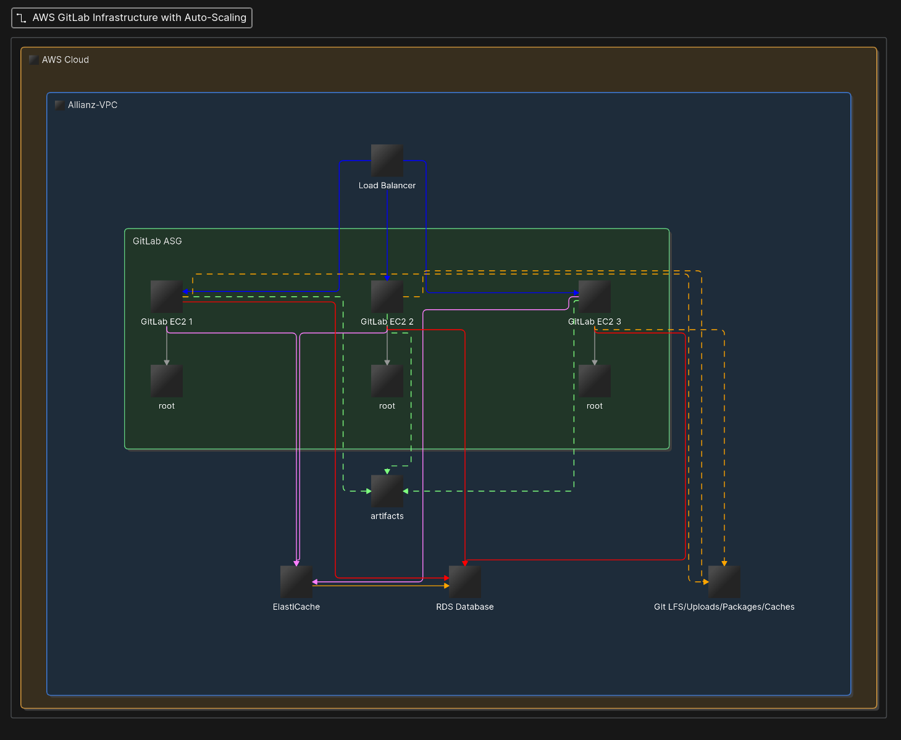

## Escenario #1

### 1. What are the main challenges to apply key rotation? What impacts can you identify?

1. Se debe decidir si re-encriptar todos los datos de inmediato, o en vez, reencriptar a medida que se vayan leyendo los recursos. Si el agente regulador exige que la rotación sea efectiva y que además los datos sean reencriptados, y si la cantidad de servicios es amplia, se deberá preparar de antemano una estrategia efectiva para la re-encriptación de todos los servicios. Para esto ayudará tener a dispocisión un servicio de monitoreo que ayude a visualizar qué servicios utilizan las llaves antiguas (como se prevee en el punto 3) y cuales ya han sido reencriptados.
2. El transporte del `key material` defe efectuarse de modo seguro (como se prevee en el punto 4).

### 2. What are the steps to apply key rotation? (high level description)

1. Se generará un nuevo set de llaves en nuestro HSM
2. El nuevo set de llaves (key material) se encriptará (wrap) utilizando el public key provisto por AWS KMS y se subirá a AWS KMS de modo seguro.
3. Para las bases de datos (RDS) y volumenes EBS se generará un snapshot - se copiará dicho snapshot, especificando la nueva llave KMS a utilizar durante el proceso de copiado/re-encriptado.
4. Para los buckets S3 se pueden reencriptar los archivos usando un S3 Batch Operation – lo cual permitiria monitorear el proceso de copiado/reencriptado en tiempo real:
<https://docs.aws.amazon.com/AmazonS3/latest/userguide/batch-ops-create-job.html>.
Alternativamente se puede utilizar un módulo de Terraform que permita ejecutar comandos shell e invocar la AWS CLI desde ahí. E.g.:
<https://registry.terraform.io/modules/Invicton-Labs/shell-resource/external/latest>.
Usar el módulo mencionado arriba será preferible en caso de que las rotaciones de llaves sean realizadas de modo frecuente – pues permitirá mantener la lógica del código versionada en nuestro repositorio.
5. Una vez reencriptados los recursos se actualizarán los aliases de las llaves usadas por cada recurso, así como los volúmenes EBS y bases de datos a enlazar en producción, idealmente a través de una única aplicación de Terraform (`terraform apply ...`).
6. Una vez todos los recursos hayan sido asociados a las nuevas llaves, las antiguas pueden ser eliminadas de AWS.

### 3. We’re required to have a monitoring service on the resources, to identify resources that are not compliant. How can we achieve this with an AWS managed service?

Esto puede realizarse de múltiples maneras! Sugeriría la creación de una Lambda Function y un scheduler de EventBridge:
<https://docs.aws.amazon.com/lambda/latest/dg/with-eventbridge-scheduler.html>.
Nuestra Lambda Function correrá de modo periódico (e.g. una vez/hora o una vez/día) y realizará las siguientes tareas:
1. Revisa el último conjunto de llaves subido a AWS KMS
2. Recorre todos nuestros recursos monitoreados (RDS, S3, EBS, etc.), identificados por sus respectivos ARNs, y revisa si éstos utilizan ya nuestra última serie de llaves para encriptación/decriptación.
3. Construye una lista de recursos que aún necesitan ser re-encriptados y genera/envía una alerta a nuestro equipo DevOps (mediante cualquer canal de alerta que tengamos disponible).

### 4. Best way to secure material during transport between our HSM and AWS KMS?

Como menciono arriba (punto 2.2), hacemos lo recomendado por AWS:
1. Preparamos nuestras llaves en nusetro HSM – aseguramos que nuestras llaves se encuentran guardadas de modo seguro y bien respaldadas.
2. Encriptamos nuestras llaves (key-material) usando la public key proporcionada por AWS KMS
3. Importamos nuestro key-material pre-encriptado en AWS (mediante la CLI o la management console)
4. Debido a que utilizamos nuestras propias llaves (BYOK), AWS no efectuará la rotación de llaves de modo automático, sino que seremos responsables de efectuarlas nosotros mismos. Sugeriría la creación de un script que ejecute los puntos a, b y c mencionados arriba de modo automático y seguro. Esto hará que el proceso sea más sencillo y estandarizado.

## Escenario #2

### 1. What weaknesses can you see on the current architecture?

Salta a relucir el uso de un solo endpoint, `api.allianz-trade.com`. Cada API podría beneficiarce de su propio endpoint – asegurando así separación de intenciones, mejor modularidad, etc. Las APIs de uso privado podrían así existir detras de una VPN/VPC (como se prevee en el punto 2).

E.g.:
```
servicio-a.interno.api.allianz-trade.com
servicio-b.interno.api.allianz-trade.com
servicio-c.interno.api.allianz-trade.com
```
etc.

Si se prefiere el uso de un solo endpoint global como entrada a la API, se puede configurar path-based-routing (como se prevee en el punto 3) para redirigir las llamadas GET en el endpoint global a llamadas a las sub-APIs internas.

E.g.:
```
api.allianz-trade.com/servicio-a/recurso => servicio-a.interno.api.allianz-trade.com/recurso
api.allianz-trade.com/servicio-b/recurso => servicio-b.interno.api.allianz-trade.com/recurso
api.allianz-trade.com/servicio-c/recurso => servicio-c.interno.api.allianz-trade.com/recurso
```
etc.

### 2. APIs intended for internal use must go private. What would the new architecture be?

Sugeriría la creación de un VPN para uso de la empresa, y una VPC en AWS en donde instalar todos los servicios de uso privado. Las cuentas VPN para los desarrolladores y servicios pueden ser gestionadas mediante un servidor VPN como Pritunl.

Se puede forzar a que el tráfico de uso interno a nuestras APIs corra a través de la VPC configurando apropiadamente los grupos de seguridad (security-groups) y reglas de ingreso (ingress rules) en AWS para cada endpoint interno.

### 3. How could CloudFront be configured to route traffic to multiple APIGWs based on path?

Existen las CloudFront Functions:
<https://docs.aws.amazon.com/AmazonCloudFront/latest/DeveloperGuide/functions-tutorial.html>
que permiten ejecutar lógica al momento de recibir requests, o antes de enviar las respuestas (responses) a los clientes. En principio podría utilizarse una función sencilla para analizar el PATH recuestado, y redirigir el tráfico a nuestro endpoint de interés.

### 4. We want to protect our regional APIGW endpoints. What would you suggest as a solution?

APIGW permite configurar rate-limiting/throttling para cada endpoint (en incluso individualmente para cada método; GET, POST, etc.) como se describe aquí:
<https://docs.aws.amazon.com/apigateway/latest/developerguide/api-gateway-request-throttling.html>.

De requerir una solución más customizada y/o avanzada, se podría instalar una Lambda function detras de la entrada de la API que analize las características de la llamada del cliente y aplique rate-limiting según nuestros propios requisitos, datos recolectados, etc.

## Escenario #3

### 1. What are the weaknesses of the current Gitlab architecture from a resilience perspective?

1. Salta a la vista la falta de escalabilidad – un único nodo EC2 implica un único punto de fallo!
2. Falta de estrategias de caching para la base de datos. Asumiendo un equipo grande (+1000) usuarios la performance podría verse degradada en periodos de alto uso.
3. Falta de segregación – asumiendo el resguardo de archivos grandes (Git LFS, paquetes, subidas por parte de los usuarios, caches), se podrían generar cuellos de botella en la escritura/lectura desde los discos (EBS) en periodos de alto uso.

### 2. What target architecture do you suggest to improve resiliency?

Para alcanzar alta resiliencia, podemos diseñar nuestra nueva arquitectura siguiendo las pautas indicadas por Gitlab:
<https://docs.gitlab.com/administration/reference_architectures/>.
1. Usemos un ASG de instancias EC2 esparcidas por varios `availability-zones`.
2. Asociemos un load-balancer para redirigir los requests de modo efectivo a nuestras varias instancias.
3. Crearemos un cache para nuestra base de datos usando AWS ElastiCache. Múltiples opciones existen (serverless, multinodo, etc.):
<https://docs.aws.amazon.com/AmazonElastiCache/latest/dg/WhatIs.html>.
4. Opcionalmente, almacenaremos archivos grandes en EBSs adicionales montados como volúmenes de nuestras instancias – a modo de distribuir efectivamente la carga en nuestros discos.



### 3. What monitoring practices would you implement on Gitlab to prevent service outages and degradation and be alerted as soon as possible?

1. Monitoreo en tiempo real del uso de recursos (CPU, memoria, disk-space, IO, etc) en nuestros nodos EC2 usando CloudWatch:
<https://docs.aws.amazon.com/AWSEC2/latest/UserGuide/using-cloudwatch.html>.
De nuevo, podremos instalar una Lambda Function que lea y analize todas las stats y alarmas de uso generadas y reenvie la información a cualquier canal de alerta que tengamos disponible (email/Slack/etc.)
2. Monitoreo en tiempo real de la cantidad de nodos vivos. Se generará una alerta que advierta al equipo en caso de que la cantidad de instancias EC2 corriendo Gitlab sea menor que un número predeterminado.
3. Configurar monitoreo de actividad de la base de datos – y de nuevo, creación/redirección de alertas correspondientes:
<https://docs.aws.amazon.com/AmazonRDS/latest/gettingstartedguide/managing-monitoring-perf.html>.

### 4. How would you automate the runbook of Gitlab (upgrades, configuration, etc.)

Lógicamente, se preferirá el reemplazo de instancias `inmutables` en vez de la realización de cambios in-situ. La utilización de volúmenes externos y segregados (root, artifacts, etc.) y la base de datos externa permitirá que dicho procedimiento sea fácil de realizar. Cuando sea necesario actualizar Gitlab o alterar su configuración se podrá, previamente al despliegue:

1. Pre-configurar una imagen (AMI) con los cambios deseados (versión, configuración, etc). Sugeriría el uso de Packer para la generación de las AMIs a modo de código (HCL) versionado:
<https://developer.hashicorp.com/packer>.
2. Utilización de EC2 launch-templates para configuración adicional durante la inicialización (boot) de las instancias.

Al tener ya nuestras AMIs/launch-templates actualizadas, versionadas y subidos a la nube, aplicaremos cambios a nuestro ASG mediante Terraform para que haga uso de éstos nuevos recursos. Opcionalmente usaremos `instance-refresh` para reiniciar nuestra flota de instancias EC2 en su totalidad:
<https://docs.aws.amazon.com/autoscaling/ec2/userguide/asg-instance-refresh.html>.

## Escenario #4

Se incluye en este repositorio un prototipo de módulo Terraform para la creación de respaldos (vaults) multi-región y multi-cuenta, según las especificationes del Escenario #4:
- Especificación de la frecuencia de respaldo (configurable)
- Especificación de la política de retención (días mínimos/máximos de retención - configurable)
- Encriptacion de los backups mediante llave KMS (identificada mediante alias - configurable)
- Regla de copiado (`copy_action`) del vault principal a vault secundario en misma cuenta `prod` y a vault terciario en cuenta `backup`
- Identificación de recursos a respaldar mediante etiquetas
- Vault Lock habilitado en los 3 vaults

El prototipo compila bien en mi PC corriendo el contenedor de MiniStack <https://ministack.org/> localmente. El módulo en sí se encuentra en `terraform/modules/cross-account-vault/` y un ejemplo sencillo de su utilización puede verse en `terraform/ejercicio/main.tf`.
